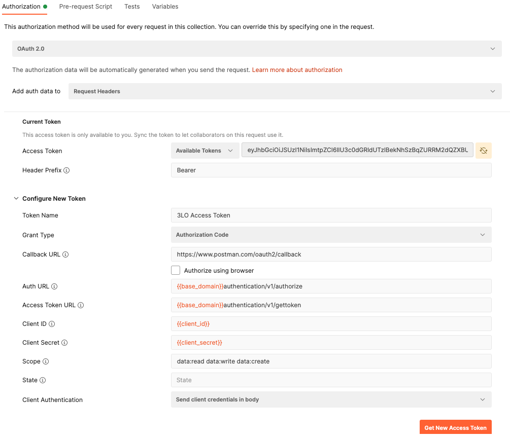
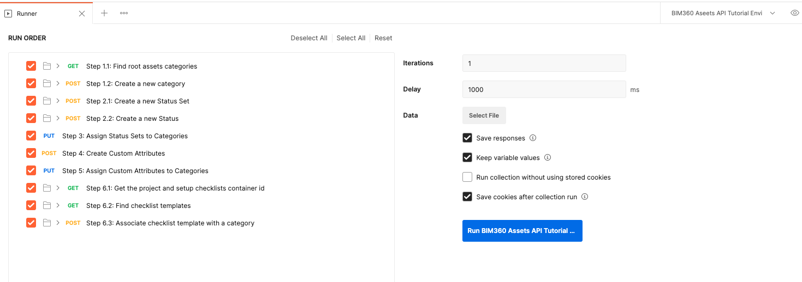

# IM360 Assets API Step-by-Step Tutorial

This folder contains a Postman Collection that contains the requests cover the current main workflow of BIM360 Assets. The collection together with the environment shows you how to create a new category, create a new asset with status and create custom attributes, associate it with assets, then update the attribute value.

## Demonstration

## Preparation before you begin:
- [Create Forge App, get access to a BIM 360 Account](https://forge.autodesk.com/en/docs/bim360/v1/tutorials/getting-started/get-access-to-account/)
- [Create BIM360 project, activate Assets module, setup project for Assets](https://help.autodesk.com/view/BIM360D/ENU/?guid=BIM360D_Assets_set_up_assets_set_up_html);

## Instructions to run the Postman tutorial are as below:

**Please watch the [Video](https://youtu.be/ETzzFfHHyVA) for the detail workflow, or follow the steps:**

### Setup Postman environment and Authorization:
- Import Postman environment & collection, please setup the following environment vialables, 
    - client_id:     Forge App Id.
    - client_secret: Forge App Secret. 

- Please add the Authorization for the collection, click **Edit Collection**, go to **Authorization** tab, make sure to use **OAuth 2.0** to get a 3 legged token, use it in the **Request Headers**.

    - Callback URL: https://www.postman.com/oauth2/callback
    - Auth URL: https://developer.api.autodesk.com/authentication/v1/authorize 
    - Access Token URL: https://developer.api.autodesk.com/authentication/v1/gettoken

### Tutorials of BIM360 Assets workflow
- Step 1: List all the Hubs, specify the **hub_name** in **Pre-request Script** which you want to work with, then save **hub_id** for the 1st BIM360 Hub, also save **account_id** (Data Management API)
- Step 2: List all the projects in the BIM360 Hub, specify the **project_name** in **Pre-request Script** which you want to work with, then get **project_id** for the specified project and save it. Also, save **assets_project_id**(Data Management API).
- Step 3: List all the categories of BIM 360 Assets, and save **asset_category_parent_id** of the ROOT category for creating a new category under it. (Assets API)
- Step 4: Create a new asset category with the value of the **asset_category_name** specified in the **Pre-request Script**. Save **asset_category_id** for the category you just created. (Assets API)
- Step 5: Get all available asset statuses, save  **asset_status_id** of the first default asset status for creating new assets. (Assets API)
- Step 6: Create a new asset with the value of the **asset_name** specified in the **Pre-request Script**. Save **asset_id** for the asset you just created. (Assets API)
- Step 7: Create a new custom attribute of the BIM 360 Assets with the value of the **custom_attribute_displayname** specified in the **Pre-request Script**. Save **custom_attribute_id** and **custom_attribute_name** for the asset you just created. (Assets API)
- Step 8: Associate the custom attribute of Step 7 with the category created in Step 4. (Assets API)
- Step 9: Assign a value to the asset's custom attribute created in Step 7. (Assets API)

- Step 10: Get the information of the specified BIM360 project, and save issues_container_id for the Issues Container(Data Management API).
- Step 11: Get all available issue types and subtypes, save  **issue_type** of the first issue type and its first subtype as **issue_subtype** for creating new issues. (Issues API)
- Step 12: Create a new issue with the value of the **issue_title** specified in the **Pre-request Script**. Save **issue_id** for the asset you just created. (Issues API)
- Step 13: Associate the issue of Step 11 with the asset created in Step 6. (Assets API)
- Step 14: Get the information of the specified BIM360 project, and save issues_container_id for the Issues Container(Data Management API).
- Step 15: Get all available checklist templates, save  **checklist_template_id** of the first checklist template for associating it with the assets. (Checklists API)
- Step 16: Associate the checklist template of Step 13 with the category created in Step 4. (Assets API)

Until now, you should have successfully created an asset with right status, category, custom attribute and issue. In addition, assign a checklist template to the asset category.

## Further Reading
### Automate Workflow with Postman Collection Runner
**With the help of the Postman Collection Runner, you can actually automate the workflow, it helps you to quick verify your workflow with BIM 360 Assets API, or to do automation test to catch all the API issues|regresions**

**Please watch the [Video](https://youtu.be/gPBiAl8xE-U) for the detail workflow, or follow the steps:**

### Tutorials about workflow

- Import the Postman **Collection** and **Environment** under the same folder.
- Please add the Authorization for the collection, click **Edit Collection**, go to **Authorization** tab, make sure to use **OAuth 2.0** to get a 3 legged token, use it in the **Request Headers**.

    - Callback URL: https://www.postman.com/oauth2/callback
    - Auth URL: https://developer.api.autodesk.com/authentication/v1/authorize 
    - Access Token URL: https://developer.api.autodesk.com/authentication/v1/gettoken
- Run Postman **Collection Runner**, select the collection, check&uncheck items like the below snapshot, select the environment, set **Delay** to 1000ms
- Click **Run BIM360 Assets...** button to start, you will see the result of the workflow.

**Note:** The collection will first create an asset category, then create an asset and assign the asset to the category, after that, create a custom attribute, and then attach the custom attribute to the category, and assign a value of the custom attribute to that asset.

## License
This sample is licensed under the terms of the [MIT License](http://opensource.org/licenses/MIT). Please see the [LICENSE](LICENSE) file for full details.

## Written by
Eason Kang [@yiskang](https://twitter.com/yiskang), [Forge Partner Development](http://forge.autodesk.com)
