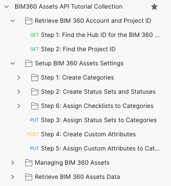

# BIM360 Assets API Step-by-Step Tutorial

This folder contains a Postman Collection that includes the requests covering the current main workflow of BIM360 Assets. The collection together with the environment shows you how to use Assets API. It includes [Retrieve BIM 360 Account and Project ID](#asset-tutorial-1), [Setup BIM 360 Assets Settings](#asset-tutorial-2), [Create BIM 360 Assets Data](#asset-tutorial-3), and [Retrieve BIM 360 Assets Data](#asset-tutorial-4).

## Demonstration

[Click here or click on the above picture to view the video](https://youtu.be/2u3kSjm-XEo)

## Preparation before you begin:
- [Create Forge App, get access to a BIM 360 Account](https://forge.autodesk.com/en/docs/bim360/v1/tutorials/getting-started/get-access-to-account/)
- [Create BIM360 project, activate Assets module, setup project for Assets](https://help.autodesk.com/view/BIM360D/ENU/?guid=BIM360D_Assets_set_up_assets_set_up_html);

## Instructions to run the Postman tutorial are as below:

**Please watch the [Video](https://youtu.be/2u3kSjm-XEo) for the detail workflow, or follow the steps:**

### Setup Postman environment and Authorization:
- Import Postman environment & collection, please setup the following environment vialables, 
    - client_id:     Forge App Id.
    - client_secret: Forge App Secret.

- Please add the Authorization for the collection, click **Edit Collection**, go to **Authorization** tab, make sure to use **OAuth 2.0** to get a 3 legged token, use it in the **Request Headers**.

    - Callback URL: https://www.postman.com/oauth2/callback
    - Auth URL: https://developer.api.autodesk.com/authentication/v1/authorize 
    - Access Token URL: https://developer.api.autodesk.com/authentication/v1/gettoken

### Tutorials of BIM360 Assets workflow

- **Retrieve BIM 360 Account and Project ID**: It contains a set of Postman scripts demonstrating how to obtain your BIM 360 Account and Project ID. If you already have these, you can skip this tutorial.

  - Step 1: List all the Hubs, specify the **hub_name** in **Pre-request Script** which you want to work with, then save **hub_id** for the 1st BIM360 Hub, also save **account_id**. (Data Management API)
  - Step 2: List all the projects in the BIM360 Hub, specify the **project_name** in **Pre-request Script** which you want to work with, then get **project_id** for the specified project and save it. Also, save **assets_project_id**. (Data Management API)

- **Setup BIM 360 Assets Settings**: It contains a set of Postman scripts demonstrating how to set up a new BIM 360 project's Asset settings.

  - Step 1: Create Categories
    - Step 1.1: List all the categories of BIM 360 Assets, and save **asset_category_parent_id** of the ROOT category for creating a new category under it. (Assets API)
    - Step 1.2: Create a new asset category with the value of the **asset_category_name** specified in the **Pre-request Script**. Save **asset_category_id** for the category you just created. (Assets API)
  - Step 2: Create Status Sets and Statuses
    - Step 2.1: Create a new Asset status set with the value of the **asset_status_set_name** specified in the **Pre-request Script**. Save **asset_status_step_set_id** for the Asset status set you just created. (Assets API)
    - Step 2.2: Create a new Asset status and append it to the status set created in Step 2.1. Save **asset_status_id** for the Asset status you just created. (Assets API)
  - Step 3: Assign Status Sets created in Step 2 to the category of Step 1. (Assets API)
  - Step 4: Create a new custom attribute of the BIM 360 Assets with the value of the **custom_attribute_displayname** specified in the **Pre-request Script**. Save **custom_attribute_id** and **custom_attribute_name** for the asset you just created. (Assets API)
  - Step 5: Assign Custom Attributes created in Step 4. to the category of Step 1. (Assets API)
  - Step 6: Assign Checklists to Categories
    - Step 6.1: Get the information of the specified BIM360 project, and save issues_container_id for the Issues Container(Data Management API).
    - Step 6.2: Get all available checklist templates, save  **checklist_template_id** of the first checklist template for associating it with the assets. (Checklists API)
    - Step 6.3: Associate the checklist template of Step 13 with the category created in Step 4. (Assets API)

- **Create BIM 360 Assets Data**:  It contains a set of Postman scripts demonstrating how to create Asset data, work with Issue API to crate an issue, and assign the issue to an asset.

  - Step 1: Get all available asset categories, save  **asset_category_id** of the last one for creating new assets. (Assets API)
  - Step 2: Get asset status sets assigned to category ids, save  **asset_status_set_id** of the first one for obtaining asset statuses. (Assets API)
  - Step 3: Get asset statuses under given status set ids, save  **asset_status_id** of the first value of first status set for creating new assets. (Assets API)
  - Step 4: Create a new asset with the value of the **asset_name** specified in the **Pre-request Script**. Save **asset_id** for the asset you just created. (Assets API)
  - Step 5: Assign Issues to Assets
    - Step 5.1: Get the information of the specified BIM360 project, and save **issues_container_id** for the Issues Container. (Data Management API)
    - Step 5.2: Get all available issue types and subtypes, save  **issue_type** of the first issue type and its first subtype as **issue_subtype** for creating new issues. (Issues API)
    - Step 5.3: Create a new issue with the value of the **issue_title** specified in the **Pre-request Script**. Save **issue_id** for the asset you just created. (Issues API)
    - Step 5.4: Associate the issue of Step 4.3 with the asset created in Step 3. (Assets API)
  - Step 6: Get all available custom attributes assign to the category, find a text-typed custom attribute, and save **custom_attribute_id** and **custom_attribute_name** for updating custom attributes' value.
  - Step 7: Update custom attribute value to `Hello World!`

- **Retrieve BIM 360 Assets Data**: It contains a set of Postman scripts demonstrating how to fetch your complete set of BIM 360 Asset data and metadata. This collection can be for the entirety of your Asset data or filtered to a subset of Asset data.

  - Step 1: Fetch all available assets in your project. (Assets API)
  - Step 2: Fetch all available assets categories in your project. (Assets API)
  - Step 3: Fetch Status Sets And Asset Statuses
    - Step 3.1: Fetch all available Asset Status Sets in your project. (Assets API)
    - Step 3.2: Fetch all available Asset Status in your project. (Assets API)
  - Step 4: Fetch Asset Status Sets assign to the ids of categories given in the POST body. (Assets API)
  - Step 5: Fetch all available Asset Custom Attributes in your project. (Assets API)
  - Step 6: Fetch all available Custom Attributes assign to the given id of the category. (Assets API)
  - Step 7: Fetch Locations (Not available yet since Locations API hasn't been released)
  - Step 8: Fetch  all available relationship data of the Assets data in your project (Relationships API)

## Further Reading
### Automate Workflow with Postman Collection Runner
**With the help of the Postman Collection Runner, you can actually automate the workflow, it helps you to quick verify your workflow with BIM 360 Assets API, or to do automation test to catch all the API issues|regresions**

**Please watch the [Video](https://youtu.be/uxKom3KVgpU) for the detail workflow, or follow the steps:**

### Tutorials about workflow

- Import the Postman **Collection** and **Environment** under the same folder.
- Please add the Authorization for the collection, click **Edit Collection**, go to **Authorization** tab, make sure to use **OAuth 2.0** to get a 3 legged token, use it in the **Request Headers**.

    - Callback URL: https://www.postman.com/oauth2/callback
    - Auth URL: https://developer.api.autodesk.com/authentication/v1/authorize 
    - Access Token URL: https://developer.api.autodesk.com/authentication/v1/gettoken
- Run Postman **Collection Runner**, select the collection, check&uncheck items like the below snapshot, select the environment, set **Delay** to 1000ms
- Click **Run BIM360 Assets...** button to start, you will see the result of the workflow.

  - Run order settings for **Setup BIM 360 Assets Settings**
    
  - Run order settings for **Create BIM 360 Assets Data**
    

**Note:** The collection will first create an asset category, then create an asset and assign the asset to the category, after that, create a custom attribute, and then attach the custom attribute to the category, and assign a value of the custom attribute to that asset.

## License
This sample is licensed under the terms of the [MIT License](http://opensource.org/licenses/MIT). Please see the [LICENSE](LICENSE) file for full details.

## Written by
Eason Kang [@yiskang](https://twitter.com/yiskang), [Forge Partner Development](http://forge.autodesk.com)
